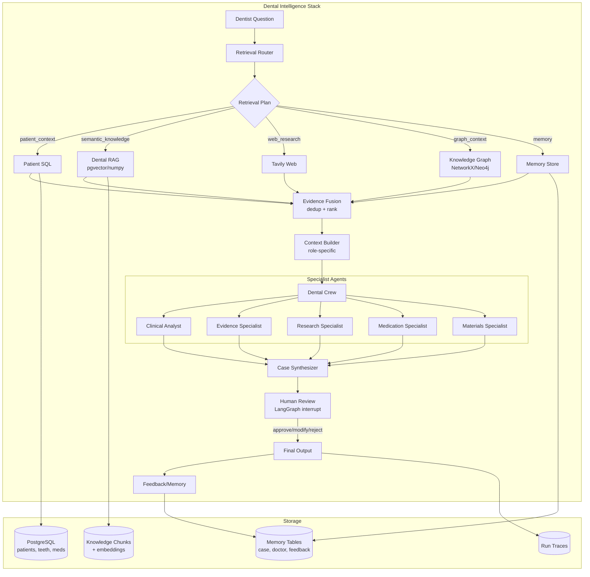
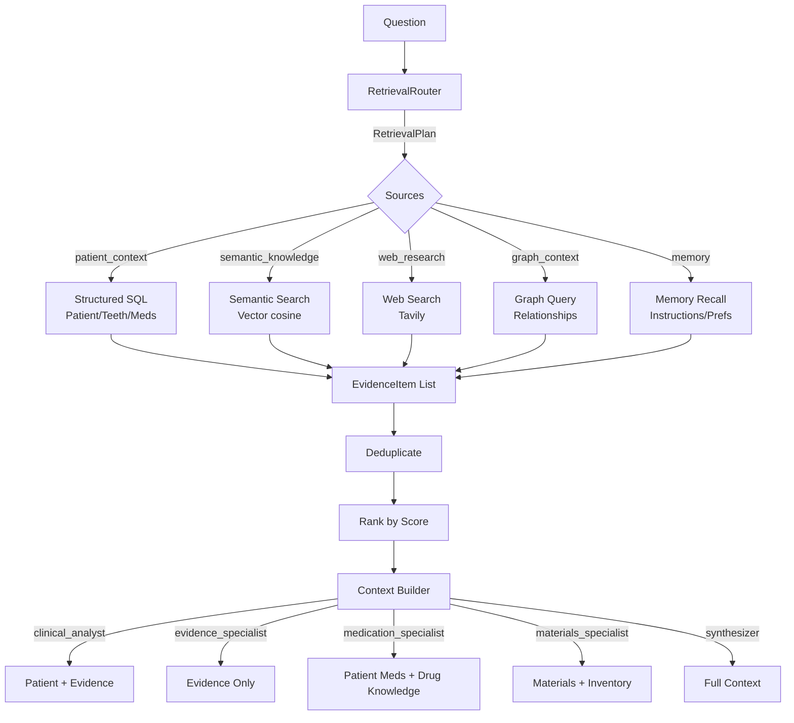
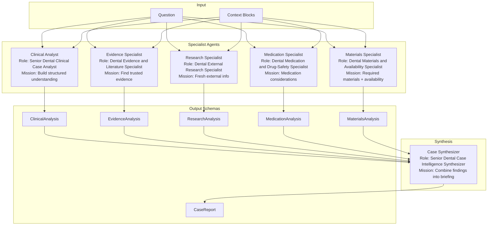
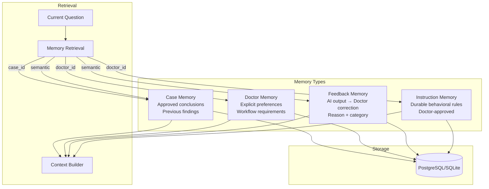
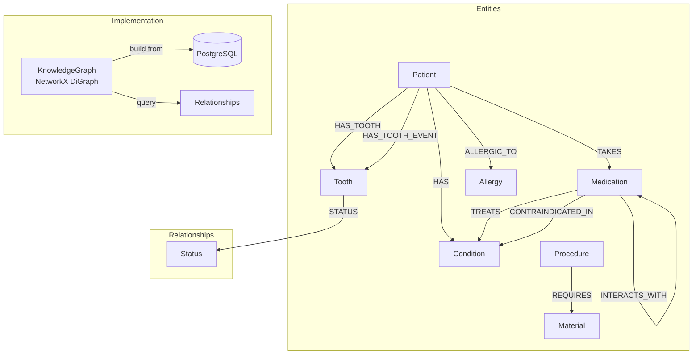
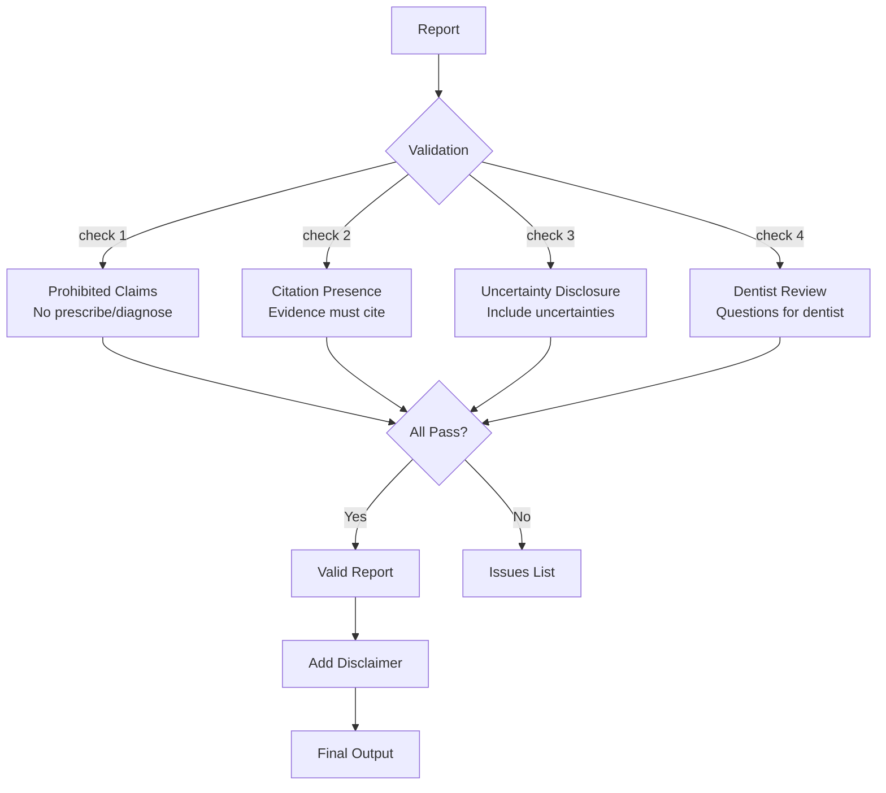
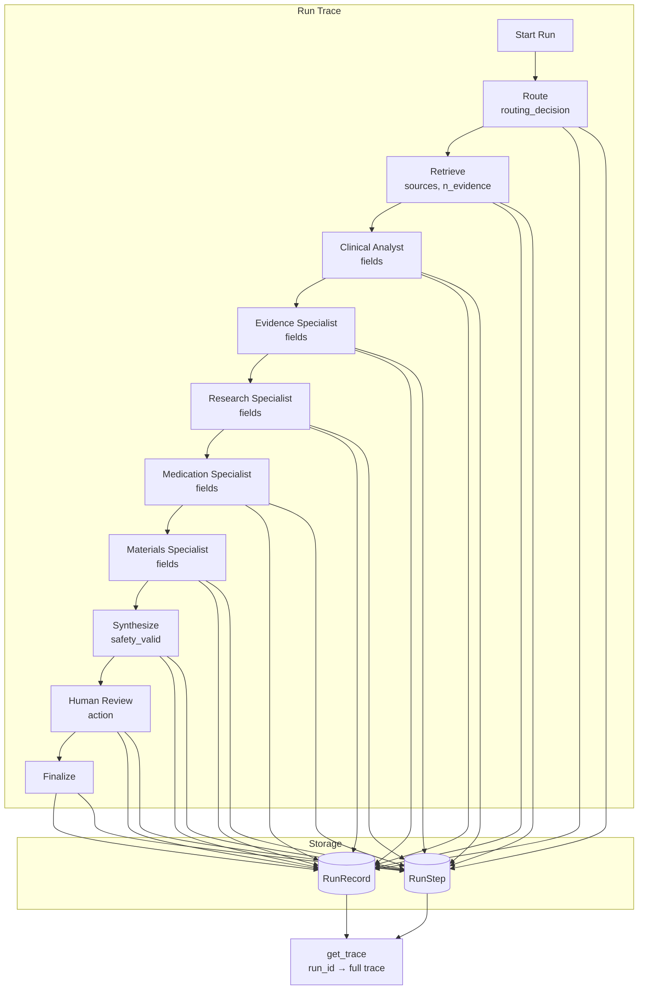
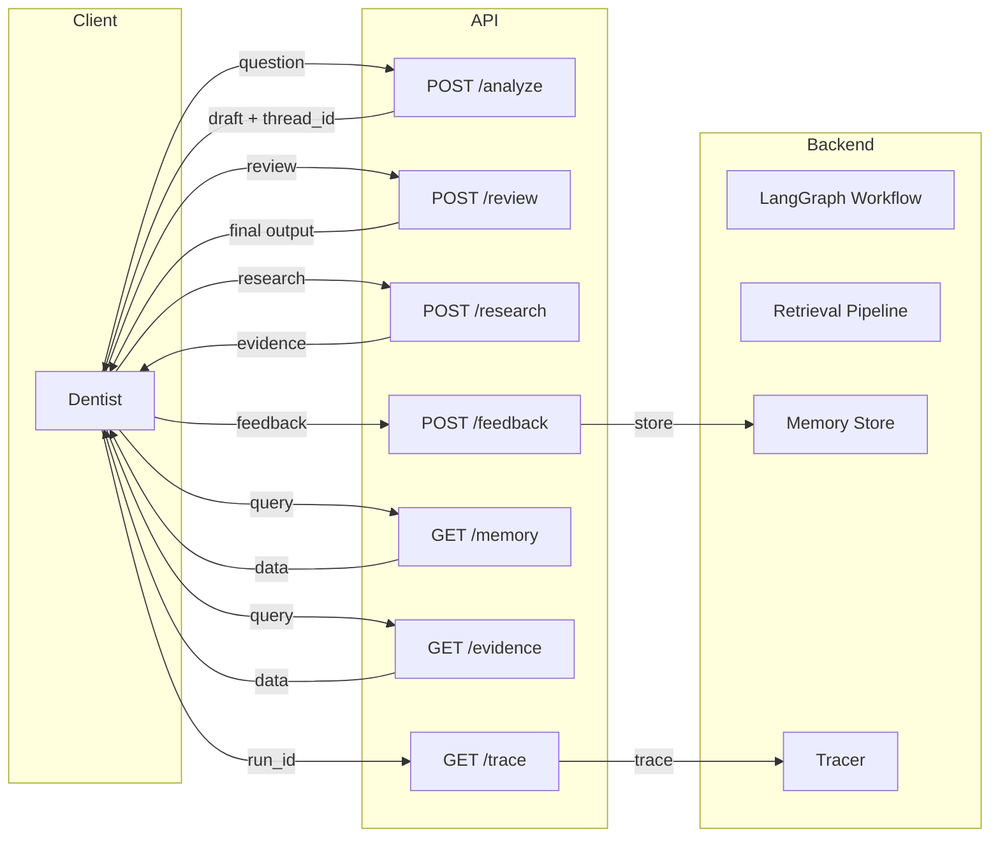

# Architecture Diagrams

## System Architecture

## LangGraph Workflow

```mermaid
graph LR
    START --> route
    route --> retrieve
    retrieve --> clinical_analyst
    clinical_analyst --> evidence_specialist
    evidence_specialist --> research_specialist
    research_specialist --> medication_specialist
    medication_specialist --> materials_specialist
    materials_specialist --> synthesize
    synthesize --> human_review
    human_review -->|interrupt| PAUSE[Wait for Review]
    PAUSE -->|resume| finalize
    finalize --> END
    
    style human_review fill:#f9f,stroke:#333,stroke-width:4px
    style PAUSE fill:#ff9,stroke:#333,stroke-width:2px
```

## Retrieval Pipeline

## Agent Architecture

## Memory Architecture

## Knowledge Graph

## Safety Guardrails

## Observability

## API Endpoints

