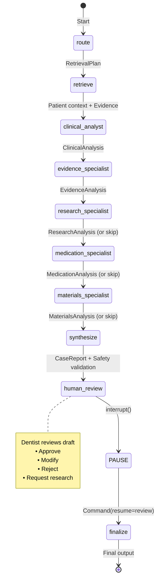

# Dental AI Stack — End-to-End Flow

## Complete Pipeline: Query → Output

```mermaid
flowchart TB
    subgraph INPUT["🦷 DENTIST INPUT"]
        Q["Dentist Question<br/>e.g., 'Clinical briefing for patient 1:<br/>medication considerations and caries evidence'"]
        PID["Patient ID<br/>(optional)"]
        DID["Doctor ID<br/>(optional)"]
    end

    Q & PID & DID --> ROUTER

    subgraph RETRIEVAL["🔍 RETRIEVAL PIPELINE"]
        ROUTER["Retrieval Router<br/>(keyword classification)"]
        ROUTER --> PLAN["Retrieval Plan<br/>• patient_context<br/>• semantic_knowledge<br/>• web_research<br/>• medication_knowledge<br/>• materials_data"]
        
        PLAN --> S1["Structured SQL<br/>Patient/Teeth/Meds/Allergies"]
        PLAN --> S2["Semantic Search<br/>Vector cosine (numpy)<br/>Knowledge chunks"]
        PLAN --> S3["Web Research<br/>Tavily API<br/>(if recent/current needed)"]
        PLAN --> S4["Graph Query<br/>NetworkX relationships<br/>(patient→meds→conditions)"]
        PLAN --> S5["Memory Recall<br/>Instructions/Preferences<br/>(if relevant)"]
        
        S1 & S2 & S3 & S4 & S5 --> FUSE["Evidence Fusion<br/>• Deduplicate<br/>• Rank by score<br/>• Assign ranking"]
        FUSE --> EVIDENCE["EvidenceItem List<br/>(source, title, content, score, citation)"]
    end

    EVIDENCE --> CONTEXT

    subgraph CONTEXT_BUILD["📋 CONTEXT BUILDER"]
        CONTEXT["Build role-specific context<br/>for each agent"]
        CONTEXT --> CTX1["Clinical Analyst Context<br/>(patient + evidence)"]
        CONTEXT --> CTX2["Evidence Specialist Context<br/>(evidence only)"]
        CONTEXT --> CTX3["Medication Specialist Context<br/>(patient meds + drug knowledge)"]
        CONTEXT --> CTX4["Materials Specialist Context<br/>(materials + inventory)"]
        CONTEXT --> CTX5["Synthesizer Context<br/>(full context)"]
    end

    CTX1 & CTX2 & CTX3 & CTX4 & CTX5 --> CREW

    subgraph AGENTS["🤖 MULTI-AGENT CREW (Groq LLM)"]
        CREW["LangGraph Workflow"]
        
        CREW --> A1["1. Clinical Analyst<br/>• Build structured understanding<br/>• Identify findings, history, missing info<br/>• Output: ClinicalAnalysis"]
        A1 --> A2["2. Evidence Specialist<br/>• Synthesize relevant evidence<br/>• Cite sources, note contradictions<br/>• Output: EvidenceAnalysis"]
        A2 --> A3["3. Research Specialist<br/>(if web_research=true)<br/>• Fresh external evidence<br/>• Output: ResearchAnalysis"]
        A3 --> A4["4. Medication Specialist<br/>(if meds present)<br/>• Drug interactions, precautions<br/>• Output: MedicationAnalysis"]
        A4 --> A5["5. Materials Specialist<br/>(if materials_data=true)<br/>• Required items, availability<br/>• Output: MaterialsAnalysis"]
        A5 --> A6["6. Case Synthesizer<br/>• Combine all specialist outputs<br/>• 14-section report<br/>• Output: CaseReport"]
    end

    A6 --> SAFETY

    subgraph SAFETY_CHECK["🛡️ SAFETY GUARDRAILS"]
        SAFETY["Validate Report<br/>• No prohibited claims<br/>• Citations present<br/>• Uncertainty disclosed<br/>• Questions for dentist"]
        SAFETY --> VALID{"Valid?"}
        VALID -->|Yes| ADD_DISCLAIMER["Add disclaimer"]
        VALID -->|No| FLAG["Flag issues"]
        ADD_DISCLAIMER --> DRAFT["Draft Report"]
    end

    DRAFT --> HITL

    subgraph HITL_FLOW["👨‍⚕️ HUMAN-IN-THE-LOOP REVIEW"]
        HITL["LangGraph interrupt()<br/>Pause workflow"]
        HITL --> DENTIST_REVIEW["Dentist Review<br/>• Read draft report<br/>• Check evidence<br/>• Verify recommendations"]
        DENTIST_REVIEW --> DECISION{"Decision?"}
        DECISION -->|Approve| APPROVE["Approve<br/>(note: 'looks good')"]
        DECISION -->|Modify| MODIFY["Modify<br/>(add corrections)"]
        DECISION -->|Reject| REJECT["Reject<br/>(note: reasons)"]
        DECISION -->|Request Research| RESEARCH["Request more research<br/>(note: what to find)"]
        APPROVE & MODIFY & REJECT & RESEARCH --> RESUME["LangGraph Command(resume=review)"]
    end

    RESUME --> FINALIZE

    subgraph FINAL["✅ FINALIZATION"]
        FINALIZE["Finalize Node<br/>• Apply review decision<br/>• Store final output"]
        FINALIZE --> MEMORY_WRITE["Memory Write<br/>• If approved: store case finding<br/>• If modified/rejected: store feedback"]
        MEMORY_WRITE --> TRACE["Observability Trace<br/>• Record all steps<br/>• Store run metadata"]
        TRACE --> OUTPUT["Final Output<br/>• Report (14 sections)<br/>• Review action<br/>• Disclaimer<br/>• Modifications (if any)"]
    end

    OUTPUT --> DISPLAY

    subgraph DISPLAY_OUT["📊 OUTPUT TO DENTIST"]
        DISPLAY["Display Final Report<br/>• Case overview<br/>• Documented findings<br/>• Evidence summary<br/>• Medication considerations<br/>• Materials needed<br/>• Uncertainties<br/>• Missing information<br/>• Questions for dentist<br/>• Citations<br/>• Draft conclusion"]
    end

    style INPUT fill:#e1f5ff,stroke:#0288d1,stroke-width:3px
    style RETRIEVAL fill:#fff3e0,stroke:#f57c00,stroke-width:3px
    style CONTEXT_BUILD fill:#f3e5f5,stroke:#7b1fa2,stroke-width:3px
    style AGENTS fill:#e8f5e9,stroke:#388e3c,stroke-width:3px
    style SAFETY_CHECK fill:#ffebee,stroke:#d32f2f,stroke-width:3px
    style HITL_FLOW fill:#fff9c4,stroke:#f9a825,stroke-width:3px
    style FINAL fill:#e0f2f1,stroke:#00796b,stroke-width:3px
    style DISPLAY_OUT fill:#fce4ec,stroke:#c2185b,stroke-width:3px
```

## LangGraph State Machine

## Data Flow Summary

```mermaid
graph LR
    A[Dentist Query] -->|1. Route| B[Retrieval Plan]
    B -->|2. Retrieve| C[Patient SQL + Knowledge + Web + Graph + Memory]
    C -->|3. Fuse| D[Evidence Items]
    D -->|4. Build Context| E[Role-specific contexts]
    E -->|5. Agents| F[5 Specialists + Synthesizer]
    F -->|6. Safety| G[Validated Report]
    G -->|7. HITL| H[Dentist Review]
    H -->|8. Finalize| I[Final Output + Memory + Trace]
    I -->|9. Display| J[Dentist]
    
    style A fill:#e3f2fd
    style J fill:#fce4ec
    style H fill:#fff9c4
```

## Key Components

| Component | Technology | Purpose |
|-----------|-----------|---------|
| **Retrieval Router** | Keyword classification | Determine which sources to query |
| **Structured SQL** | SQLAlchemy + SQLite/Postgres | Patient data, teeth, meds, allergies |
| **Semantic Search** | sentence-transformers + numpy cosine | Dental knowledge base (pgvector-ready) |
| **Web Research** | Tavily API | Fresh/external evidence |
| **Knowledge Graph** | NetworkX | Relationships (patient→meds→conditions) |
| **Memory** | SQLAlchemy tables | Case findings, doctor preferences, feedback |
| **Agents** | Groq (gpt-oss-120b) + Pydantic | 5 specialists + synthesizer |
| **Orchestration** | LangGraph | Workflow state, HITL, checkpointing |
| **Safety** | Regex + validation | Prohibited claims, citations, uncertainty |
| **Observability** | Run/Step tables | Trace every decision |
| **API** | FastAPI | 13 endpoints for analyze/review/research |
| **CLI** | argparse | 8 commands (seed, ask, analyze, serve, etc.) |
